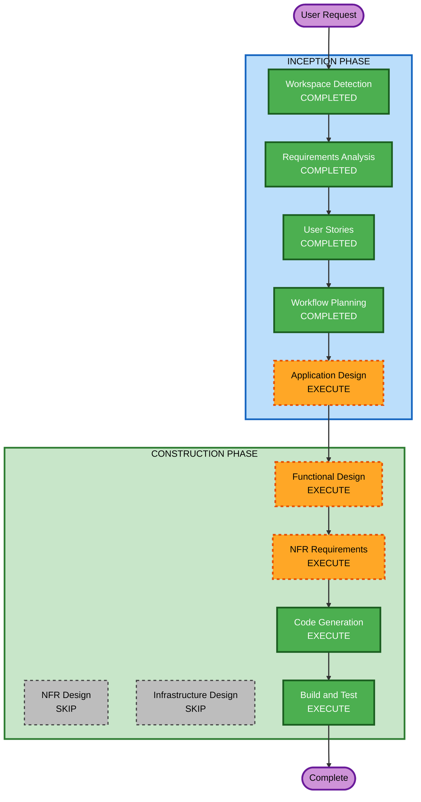

# Execution Plan — "Pots & Parliament"

## Detailed Analysis Summary

### Change Impact Assessment
- **User-facing changes**: Yes — entire game is user-facing (player experience)
- **Structural changes**: Yes — new project, full architecture to define
- **Data model changes**: Yes — map format, entity models, game state
- **API changes**: N/A — no backend services
- **NFR impact**: Yes — 60fps performance target, browser compatibility

### Risk Assessment
- **Risk Level**: Medium (new project, complex rendering engine, but no production dependencies)
- **Rollback Complexity**: Easy (greenfield, no existing users)
- **Testing Complexity**: Moderate (rendering correctness, game feel, performance targets)

---

## Workflow Visualization



### Text Alternative
```
INCEPTION PHASE:
  1. Workspace Detection      [COMPLETED]
  2. Requirements Analysis    [COMPLETED]
  3. User Stories             [COMPLETED]
  4. Workflow Planning        [COMPLETED]
  5. Application Design      [EXECUTE]

CONSTRUCTION PHASE (single unit):
  6. Functional Design       [EXECUTE]
  7. NFR Requirements        [EXECUTE]
  8. NFR Design              [SKIP]
  9. Infrastructure Design   [SKIP]
 10. Code Generation         [EXECUTE]
 11. Build and Test          [EXECUTE]
```

---

## Phases to Execute

### INCEPTION PHASE
- [x] Workspace Detection (COMPLETED)
- [x] Requirements Analysis (COMPLETED)
- [x] User Stories (COMPLETED)
- [x] Workflow Planning (IN PROGRESS)
- [ ] Application Design - **EXECUTE**
  - **Rationale**: New project needs component identification, service boundaries, and module structure defined. The raycaster, game loop, entity system, input handling, audio, and map loading are distinct components that need interface design before coding.
- [ ] Units Generation - **SKIP**
  - **Rationale**: This is a single-unit prototype (1 playable level with core mechanics). No decomposition into multiple independent units needed — everything is tightly coupled for the prototype.

### CONSTRUCTION PHASE (Single Unit: "Prototype")
- [ ] Functional Design - **EXECUTE**
  - **Rationale**: Game systems have complex interactions (raycaster math, entity state machines, collision detection, combat calculations). Detailed business logic design needed before code generation.
- [ ] NFR Requirements - **EXECUTE**
  - **Rationale**: Tech stack selection needed (which Phaser version? Canvas vs WebGL?). Performance target (60fps) requires explicit rendering strategy. Browser compatibility constraints affect API choices.
- [ ] NFR Design - **SKIP**
  - **Rationale**: NFR patterns will be straightforward for a browser game prototype (requestAnimationFrame loop, asset preloading, sprite batching). No complex NFR architecture patterns needed beyond what's determined in NFR Requirements.
- [ ] Infrastructure Design - **SKIP**
  - **Rationale**: No cloud infrastructure. The game is a static web app. Build tooling (bundler, dev server) will be covered in Code Generation planning.
- [ ] Code Generation - **EXECUTE** (ALWAYS)
  - **Rationale**: Core deliverable. Part 1 will create detailed implementation plan, Part 2 will generate the game code.
- [ ] Build and Test - **EXECUTE** (ALWAYS)
  - **Rationale**: Build instructions, test strategy (property-based tests for math/serialization), and verification steps.

---

## Success Criteria
- **Primary Goal**: Playable prototype in a web browser — 1 level, raycaster rendering, movement, 1 weapon, 1 enemy type, doors, 1 secret, HUD, basic audio
- **Key Deliverables**:
  - Working TypeScript + Phaser/PixiJS raycaster game
  - JSON map format with 1 authored level
  - All 25 user story acceptance criteria met
  - Visually accurate to Icelandic parliament architecture
  - 60fps performance on modern browsers
- **Quality Gates**:
  - Raycaster renders correctly (no visual glitches)
  - Movement feels fast and responsive
  - Combat provides clear feedback
  - Game loads and runs in Chrome/Firefox/Safari/Edge
  - Property-based tests pass for math utilities and map serialization
